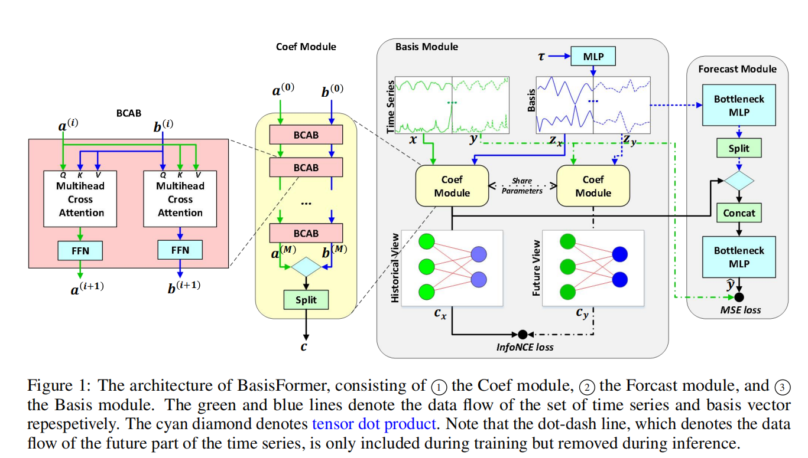
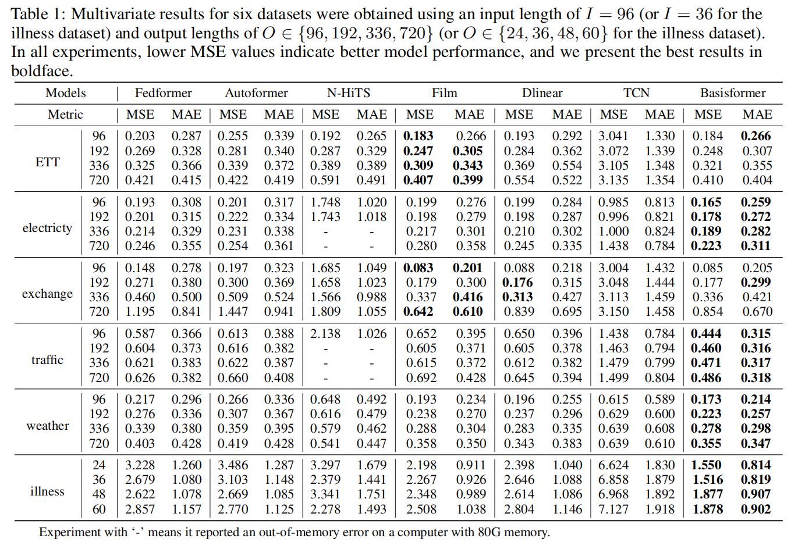
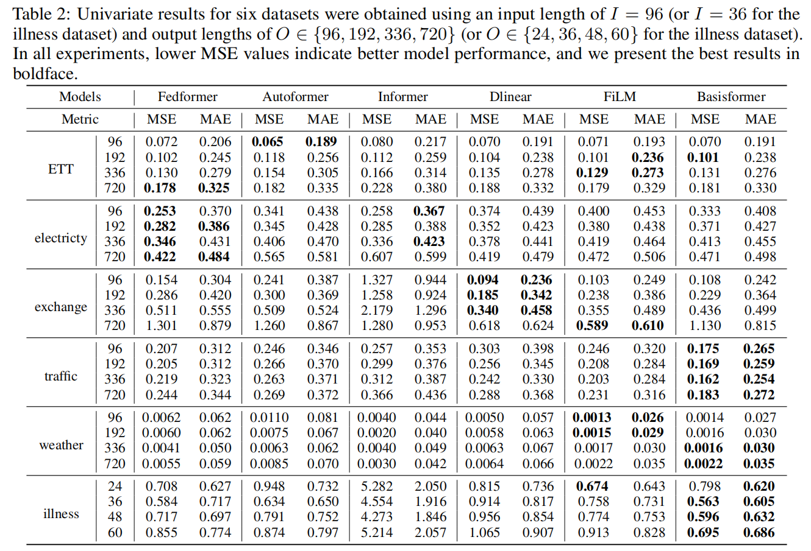

# BasisFormer: Attention-based Time Series Forecasting with Learnable and Interpretable Basis

This is the pytorch implementation of Basisformer in the Neurips paper: [BasisFormer: Attention-based Time Series Forecasting with Learnable and Interpretable Basis](https://openreview.net/forum?id=xx3qRKvG0T)

The architecture of our model(Basisformer) is shown as below:


Through extensive experiments on six datasets, we demonstrate that BasisFormer outperforms previous state-of-the-art methods by 11.04% and 15.78% respectively for univariate and multivariate forecasting tasks.

## Setup

### 1. Create conda environment(Optional)
```
conda create -n basisformer -y python=3.8 
conda activate basisformer
```

### 2. Install dependecies
Install the required packages
```
pip install -r requirements.txt
```


### 3. Download the data
We follow the same setting as previous work. The datasets for all the six benchmarks can be obtained from [[Autoformer](https://github.com/thuml/Autoformer)]. The datasets are placed in the 'all_six_datasets' folder of our project. The tree structure of the files are as follows:

```
Basisformer\all_six_datasets
│
├─electricity
│
├─ETT-small
│
├─exchange_rate
│
├─illness
│
├─traffic
│
└─weather
```

### 4. Experimental setup
The length of the historical input sequence is maintained at $96$(or $36$ for the illness dataset), whereas the length of the sequence to be predicted is selected from a range of values, i.e., $\{96, 192, 336, 720\}$ ($\{24, 36, 48, 60\}$ for the illness dataset). Note that the input length is fixed to be 96 for all methods for a fair comparison. The evaluation is based on the mean squared error (MSE) and mean absolute error (MAE) metrics

## Main Results

### 1. Multivariate Results


### 2. Univariate Results


## Train and Evaluate

### 1. Multivariate forecasting
```
sh script/M.sh
```

### 2. Univariate forecasting
```
sh script/S.sh
```

**Note:** 
If you want to run multiple GPUs in parallel, you can replace `script/M.sh` and `script/S.sh` with `script/M_parallel.sh` and `script/S_parallel.sh`, respectively.

### 3. (Optional) Training logs and Weight files
Training logs and weight files can be obtained from [Baidu Netdisk](https://pan.baidu.com/s/1YTmg1GQmFGCFJYIQkQGpQg)(with an extract code: jqsr) or [Google Drive](https://drive.google.com/file/d/1W7eSq3mUAQHdk4-QsO4Hp63yPBeKKMd9/view?usp=sharing)

## Citation

If you find this repo useful, please cite our paper. 
```
@inproceedings{ni2023basisformer,
  title={{Basisformer}: Attention-based Time Series Forecasting with Learnable and Interpretable Basis},
  author={Ni, Zelin and Yu, Hang and Liu, Shizhan and Li, Jianguo and Lin, Weiyao},
  booktitle={Advances in Neural Information Processing Systems},
  year={2023}
}
```

## Contact

If there are any issues, please ask in the GitHub Issue module.

## Acknowledgement

We appreciate the following github repos a lot for their valuable code base or datasets:

https://github.com/MAZiqing/FEDformer

https://github.com/thuml/Autoformer

https://github.com/zhouhaoyi/Informer2020

https://github.com/zhouhaoyi/ETDataset

https://github.com/laiguokun/multivariate-time-series-data

